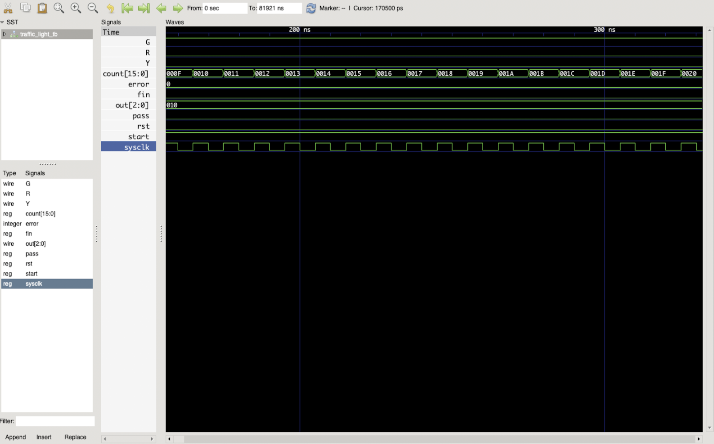

# Computer Organization
## Hw1
### 實驗結果圖:

### 程式運作流程:

* 作業環境：
OS : Mac OSX

* 使用軟體：
-iverilog
-GTKwave
-VScode

首先我是使用 iverilog + GTKwave，在VScode上進行文件編輯並且編譯執行，Modelsim 不支援MAC OSX 所以以此代替。
* 程式邏輯
藉由類似有限狀態機的方式，首先宣告reg[2:0]來代表現在的狀態，因為題目提到的狀態有六種，所以用3bit來表示(最多八種狀態;同理，cycle狀態我需要到1024的值，所以選擇了11bit的reg。
再來大致先寫好rst, pass等條件後，再將狀態機加在最後，並且讓狀態機之間交互作用，最後完成模擬這樣，概念上大概是這樣，剩下的細節由程式碼呈現。

* 編譯執行
%iverilog -o execute traffic_light_tb.v traffic_light.v
%vvp execute

* GTKwave圖形模擬
GTKwave沒有辦法讀取.fsdb波形圖檔，他主要是以.vcd檔案讀取。所以要將traffic_light_tb.v內的Wave部分改成output .vcd檔案，才能正常執行程式。
如下圖：

再使用GTKwave ,open new tab 選擇目標vcd檔案，就可以成功打開上圖了，之後就是開頭的實驗結果圖。

### 心得：
第一個遇到的問題就是modelsim不支援Mac OSX，我馬上去找了替代方案，最開始是考慮用VM的方式安裝ubuntu來進行作業，但因為VM實在是太heavy了我真的不喜歡。
後來想說可以用實驗室的server來進行作業，但因為server沒有GUI，而這次的波形模擬需要有GUI的部分會比較好處理。
所以最後才找到了可以使用iverilog+GTKwave來進行作業，再稍微做一些DEMO練習過後，就順利完成了作業，但因為前面做了一些嘗試的關係導致作業較晚完成，整體來說學到很多，很感謝老師給的這個作業。

## Hw2
### Program 1 (Find the average)
#### 實驗結果圖：

#### 程式運作流程：
首先下載Java跟MARs到MACOS上也很順利沒有問題，環境安裝的部分很順利完成。再來，我主要撰寫的概念是，先將三個數字全都加起來至t1暫存器，並且設定t2暫時儲存結果，然後藉由LOOP的方式總值每扣一次3就把t2加一，來達到除以3的效果。t3則是我用來判斷總值是否被扣至負值，若已扣至負值，則beq結果為不跳結束迴圈，最後得到的值-1(因為多算一次負值)就是答案。

#### 心得：
因為這次作業目的是讓我們熟悉MIPS環境，所以相對不會很困難，主要學會的MARS的操作方式以及實際寫了組合語言，有種很奇妙的感覺，收穫很多。

### Program 2 (Pascal)
#### 實驗結果圖：

#### 程式運作流程：
我主要撰寫的概念是，pascal function主要用來做判斷是否符合終止條件，也是就(m == n || m == 0)，若符合終止條件則beq會直接跳到result進行v0++的運算，若不符合終止條件則會強制jump到我自行定義的L1 function ，L1function會對$a0以及$a1進行運算後再回call pascal function去判斷是否符合終止條件，若不符合繼續call pascal function，結果來說call pascal function其中有252次符合終止條件，並且得到0x000000fc的結果。

#### 心得：
這題相較第一題來說較為進階，相較上題不用特別從stack裡面load word $a0跟$a1 出來復原，這題我主要有寫一個L1 function 進行$a0跟$a1運算後回call，所以有去進行嚴謹的lw $a0跟$a1復原，並且因為有遞迴的概念所以要另外寫了一個L1function，讓我對組合語言又更為熟悉了。

