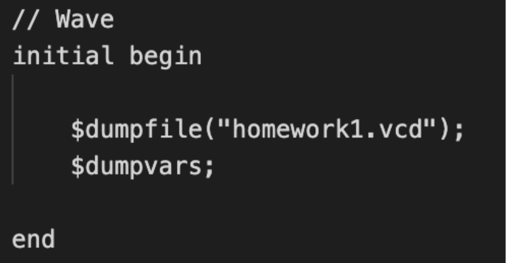

# Hw1
## 實驗結果圖:

## 程式運作流程:

* 作業環境：
OS : Mac OSX

* 使用軟體：
-iverilog
-GTKwave
-VScode

首先我是使用 iverilog + GTKwave，在VScode上進行文件編輯並且編譯執行，Modelsim 不支援MAC OSX 所以以此代替。
* 程式邏輯
藉由類似有限狀態機的方式，首先宣告reg[2:0]來代表現在的狀態，因為題目提到的狀態有六種，所以用3bit來表示(最多八種狀態;同理，cycle狀態我需要到1024的值，所以選擇了11bit的reg。
再來大致先寫好rst, pass等條件後，再將狀態機加在最後，並且讓狀態機之間交互作用，最後完成模擬這樣，概念上大概是這樣，剩下的細節由程式碼呈現。

* 編譯執行
%iverilog -o execute traffic_light_tb.v traffic_light.v
%vvp execute

* GTKwave圖形模擬
GTKwave沒有辦法讀取.fsdb波形圖檔，他主要是以.vcd檔案讀取。所以要將traffic_light_tb.v內的Wave部分改成output .vcd檔案，才能正常執行程式。
如下圖：

再使用GTKwave ,open new tab 選擇目標vcd檔案，就可以成功打開上圖了，之後就是開頭的實驗結果圖。
