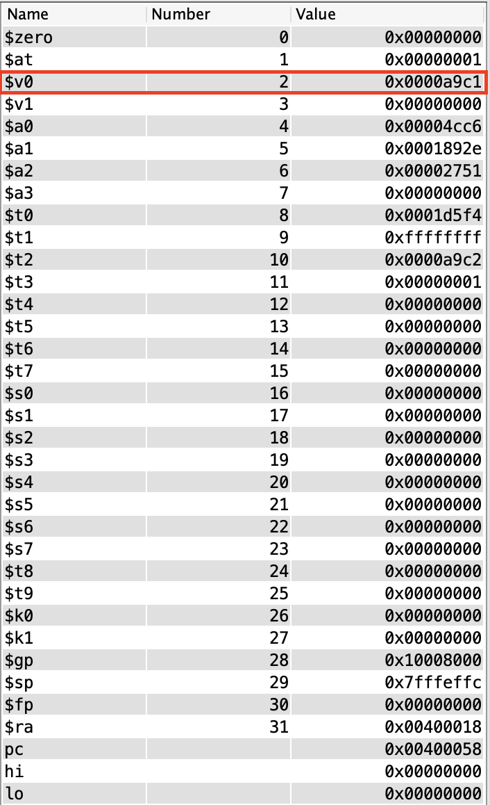

# lab2
## Program 1 (Find the average)
### 實驗結果圖：

### 程式運作流程：
首先下載Java跟MARs到MACOS上也很順利沒有問題，環境安裝的部分很順利完成。再來，我主要撰寫的概念是，先將三個數字全都加起來至t1暫存器，並且設定t2暫時儲存結果，然後藉由LOOP的方式總值每扣一次3就把t2加一，來達到除以3的效果。t3則是我用來判斷總值是否被扣至負值，若已扣至負值，則beq結果為不跳結束迴圈，最後得到的值-1(因為多算一次負值)就是答案。

## Program 2 (Pascal)
### 實驗結果圖：

### 程式運作流程：
我主要撰寫的概念是，pascal function主要用來做判斷是否符合終止條件，也是就(m == n || m == 0)，若符合終止條件則beq會直接跳到result進行v0++的運算，若不符合終止條件則會強制jump到我自行定義的L1 function ，L1 function會對$a0以及$a1進行運算後再回call pascal function去判斷是否符合終止條件，若不符合繼續call pascal function，結果來說call pascal function其中有252次符合終止條件，並且得到0x000000fc的結果。
