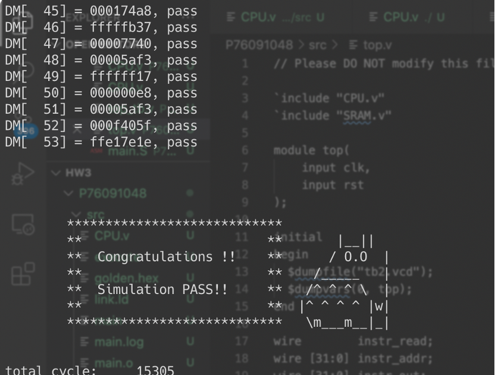
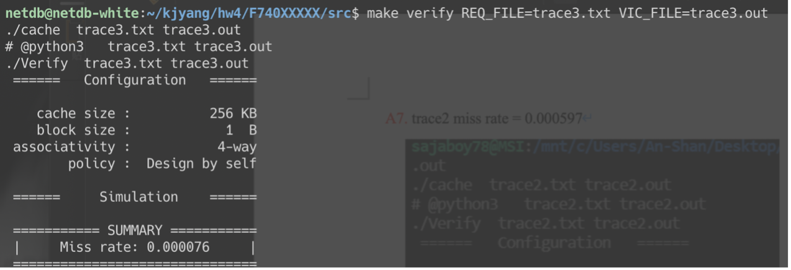

# lab3
## 實驗結果圖:
(波形圖及模擬完成截圖)

## 程式運作流程:
(簡單說明波形變化的意義)
instr_read代表instruction是否有被讀進去IM，作為CPU讀取的起點，首先要有一個state參數來進行狀態的判斷現在要執行哪一個步驟，因為state總共有五種狀態，所以需要3bits來進行支持，並且自訂了一些參數如register以及pc等等，這些都是執行cpu所必要的參數，剩下的基本上就是照個CPU執行的流程來走，如進到IM後哪些bit會先指向哪裏，或是判斷指令的type等等。
最後一樣，因為我是屬於macos的部分所以需要編譯執行iverilog：
●	編譯執行 %iverilog -o execute top.v top_tb.v %vvp execute
●	GTKwave圖形模擬 GTKwave沒有辦法讀取.fsdb波形圖檔，他主要是以.vcd檔案讀取。所以要在top.v內加入initial begin output result.vcd檔案，才能正常執行程式。
