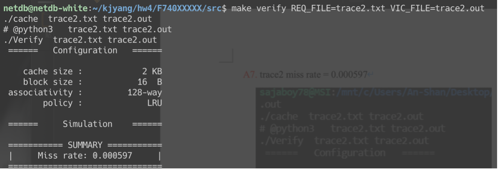
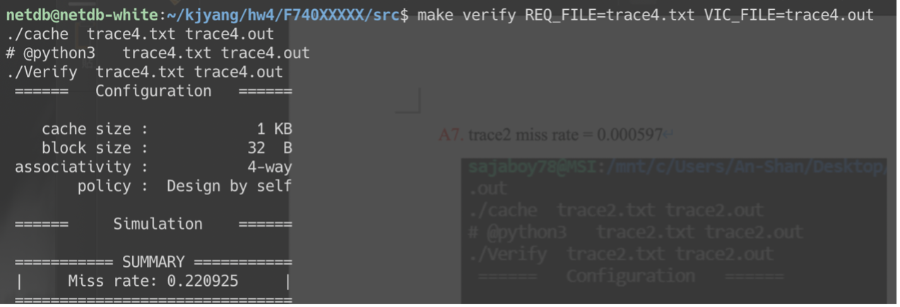

# lab4
## 問題(Question)
### Q1. How do you know the number of block from input file?
Number of blocks = 第一行的cache size/ 第二行的block size
簡單來說就是以cache的總容量除以一個block的容量就可以得到傯block的數量了。
### Q2. How do you know how many set in this cache?
從Q1中的方法我們得到block count ，之後再透過關聯度數量n來進行操作，n-way的話set數量就是 block count/n
所以 number of set = block count/ number of associativity.
### Q3. How do you know the bits of the width of the Tag ?
透過block size我的們可以得到offset bit(二進制) = n (bits)，再透過block count 得到index bit = m (bits)，最後tag bit = memory block address bit –(m+n)。
### Q4. Briefly describe your data structure of your cache.
在trace2我是利用linked list 來模擬cached 利用linked list的方式產生有指標的類陣列，在trace 3&4中我用linked list的方式進一步模擬出queue來進行FIFO的實作，而這些lineked list的每一個節點都是一個line並且value中幫寒tag和index. .
### Q5. Briefly describe your algorithm of LRU.
每當我insert到同一個index的tag值我就會把那個值都放到linked list的最尾端，衝突發生的時候最前端的tag值就會是LRU策略的刪除目標(代表都沒有insert過相同的值)，所以把該值刪除並把新的tag放到最後面(最後面代表最新)。
### Q6. Briefly describe your algorithm of your policy.
因為在trace2有練習慣LRU了，我選擇了FIFO來練習看看不同policy透過linked list的方式我時做了一個queue 然後第一個進來的值只要沒有hit(miss)就會不斷的在linked list當中往右推，在這個過程中即使hit也不會改變任何置換順序，主要是linked list實作queue的方面下了一點功夫。
### Q7. Run trace2.txt, trace3.txt and then makefile to get the miss rate and put it in your report.
trace2 miss rate = 0.000597

Trace3 miss rate = 0.000076

Trace4 miss rate = 0.220925

